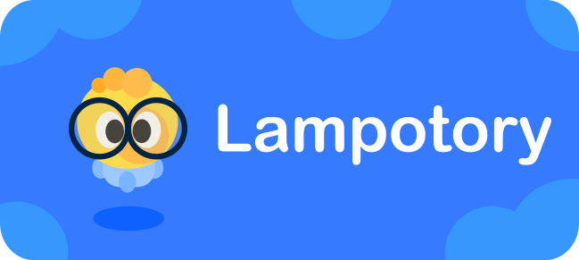

	

**Lamporoty is an open, accessible and completely free 2D virtual laboratory.**
The project wants to provide a convenient and free tool for studying physics and other subjects.
Let's make education even more accessible! Project at the stage of **alpha**. Made with **Godot engine 4.2**.

Please use my work with attribution. Not for commercial use.

****About developer****
* Author: BendySonic (BuzzeDev, mrbuzzy, mister_buzzy)
* Telegram - @mister_buzzy
* Discord - mrbuzzy
* itch-io - https://buzzydev.itch.io
